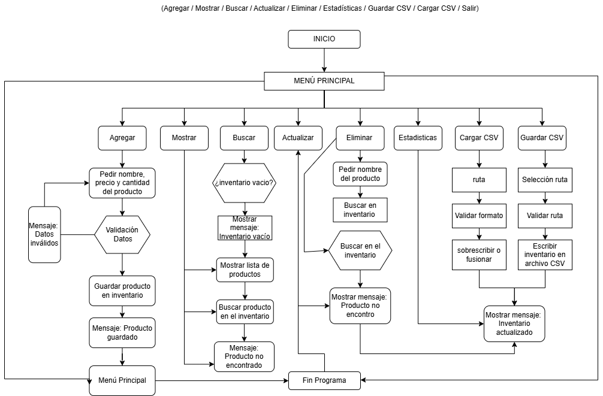

# 📦 Sistema de Gestión de Inventario en Python



---

## 📖 Descripción

Este proyecto es un **sistema de gestión de inventario en consola** desarrollado en Python.
Permite administrar productos mediante operaciones CRUD, calcular estadísticas y guardar/cargar datos utilizando archivos CSV.

El sistema está diseñado aplicando principios de **modularidad**, **manejo de errores** y uso de **estructuras de datos** como listas y diccionarios.

---

## 🎯 Objetivo del Proyecto

Aplicar conceptos fundamentales e intermedios de Python, tales como:

- Funciones y modularización
- Listas, diccionarios y tuplas
- Manejo de archivos CSV
- Validación de datos
- Manejo de excepciones (`try / except`)
- Interacción por consola

---

## ⚙️ Funcionalidades

El sistema incluye un menú interactivo con las siguientes opciones:

1. ➕ Agregar producto
2. 📋 Mostrar inventario
3. 🔍 Buscar producto
4. ✏️ Actualizar producto
5. ❌ Eliminar producto
6. 📊 Calcular estadísticas
7. 💾 Guardar inventario en CSV
8. 📂 Cargar inventario desde CSV
9. 🚪 Salir

---

## 🧠 Estructura del Proyecto

```
HISTORIA_DE_USUARIO/
│
├── functions/
│   ├── servicios.py   # Lógica del inventario (CRUD + estadísticas)
│   ├── archivos.py    # Manejo de archivos CSV
│
├── img/
│   └── Diagrama_Flujo_H3.png
│
├── main.py            # Menú principal e interacción con el usuario
├── README.md
```

---

## 🗂️ Estructura de Datos

El inventario se maneja como una **lista de diccionarios**:

```python
{
    "nombre": str,
    "precio": float,
    "cantidad": int
}
```

---

## 📊 Estadísticas del Inventario

El sistema calcula automáticamente:

- 🔢 Unidades totales
- 💰 Valor total del inventario
- 💎 Producto más caro
- 📦 Producto con mayor cantidad en stock

---

## 💾 Persistencia de Datos (CSV)

### ✔ Guardar inventario

- Guarda los datos en formato CSV
- Incluye encabezado: `nombre,precio,cantidad`
- Maneja errores de escritura

### ✔ Cargar inventario

- Valida estructura del archivo
- Omite filas inválidas
- Permite:
  - 🔄 Sobrescribir inventario
  - 🔗 Fusionar inventarios

### ✔ Manejo de errores

- Archivo no encontrado → se crea automáticamente
- Errores de formato → se reportan sin detener el programa

---

## ▶️ Cómo Ejecutar el Programa

1. Abre una terminal en la carpeta del proyecto
2. Ejecuta:

```bash
python main.py
```

3. Usa el menú para interactuar con el sistema

---

## 🧪 Validaciones Implementadas

- Precio debe ser numérico y no negativo
- Cantidad debe ser entera y no negativa
- Opciones del menú válidas
- Archivos CSV con formato correcto

---

## 📌 Ejemplo de Uso

```
=== MENÚ PRINCIPAL ===
1. Agregar producto
2. Mostrar inventario
...

Seleccione una opción: 1

Ingrese el nombre del producto: Zapatos
Ingrese el precio del producto: 50000
Ingrese la cantidad del producto: 10

Producto agregado correctamente ✅
```

---

## 🚀 Posibles Mejoras Futuras

- Interfaz gráfica (GUI)
- Base de datos (SQLite o MySQL)
- Exportación a Excel
- Reportes avanzados
- Búsqueda con filtros

---

## 👨‍💻 Autor

Proyecto desarrollado como parte de formación en programación en Python
para fortalecer habilidades en lógica, estructuras de datos y persistencia.

---
