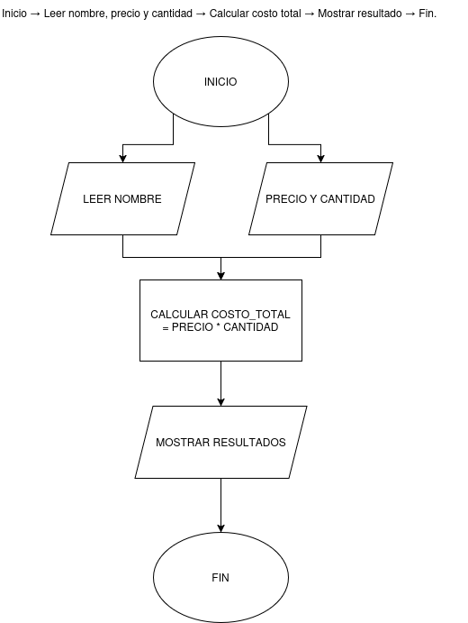

# Diagrama de Flujo



# Sistema Básico de Inventario en Python

## Descripción

Este programa es un **sistema simple de registro de inventario** desarrollado en Python.
Permite al usuario ingresar información de productos como:

- Nombre del producto
- Precio
- Cantidad disponible

El programa calcula automáticamente el **costo total del producto** (precio × cantidad) y guarda la información en una lista de inventario.

Además, incluye **validaciones básicas** para evitar que el usuario ingrese datos vacíos o incorrectos.

---

# Objetivo del Programa

El objetivo de este programa es practicar los **principios básicos de programación en Python**, como:

- Uso de `while`
- Uso de `if`
- Manejo de errores con `try / except`
- Uso de **listas**
- Uso de **diccionarios**
- Entrada de datos con `input()`
- Salida de información con `print()`

---

# Cómo Funciona el Programa

El programa funciona mediante un **ciclo repetitivo (`while`)** que permite registrar múltiples productos.

El proceso es el siguiente:

1. El usuario ingresa el **nombre del producto**.
2. El programa valida que el nombre **no esté vacío**.
3. El usuario ingresa el **precio del producto**.
4. El programa valida que el precio sea **un número válido**.
5. El usuario ingresa la **cantidad del producto**.
6. El programa valida que la cantidad sea **un número entero**.
7. El sistema calcula el **costo total del producto**.
8. Se muestra la información del producto registrado.
9. El producto se guarda en una **lista de inventario**.
10. El programa pregunta si el usuario desea **registrar otro producto**.

Si el usuario escribe **"n"**, el programa termina.

---

# Estructura del Código

El programa utiliza los siguientes elementos de Python:

### 1. Lista de Inventario

Se utiliza una lista para almacenar los productos registrados.

```python
inventario = []
```

Cada producto se guarda dentro de la lista como un **diccionario**.

---

### 2. Ciclo Principal

El programa utiliza un ciclo `while True` para permitir registrar productos continuamente.

```python
while True:
```

Este ciclo solo termina cuando el usuario decide salir.

---

### 3. Validación de Datos

El programa evita errores verificando que los datos ingresados sean correctos.

Ejemplo:

```python
while nombre == "":
```

Esto evita que el usuario deje el campo vacío.

---

### 4. Manejo de Errores

Se utiliza `try / except` para evitar errores cuando el usuario ingresa datos incorrectos.

Ejemplo:

```python
try:
    precio = float(precio_texto)
except:
    print("Error: Debe ingresar un número válido")
```

---

### 5. Diccionario del Producto

Cada producto se guarda en un diccionario con su información.

```python
producto = {
    "nombre": nombre,
    "precio": precio,
    "cantidad": cantidad,
    "total": total
}
```

---

# Ejemplo de Uso

Ejemplo de ejecución del programa:

```
Ingrese el nombre del producto: Laptop
Ingrese el precio del producto: 1200
Ingrese la cantidad del producto: 2

Producto: Laptop
Precio: 1200
Cantidad: 2
Total: 2400

¿Desea registrar otro producto? (s/n): s
```

Si el usuario decide salir:

```
¿Desea registrar otro producto? (s/n): n
Ha salido con éxito
```

---

# Conceptos de Python Utilizados

El proyecto utiliza conceptos básicos de programación:

- Variables
- Listas
- Diccionarios
- Condicionales (`if`)
- Bucles (`while`)
- Manejo de excepciones (`try / except`)
- Entrada de datos (`input`)
- Salida de datos (`print`)

---

# Posibles Mejoras Futuras

El programa puede mejorarse agregando funcionalidades como:

- Mostrar todo el inventario registrado
- Buscar productos por nombre
- Eliminar productos
- Guardar el inventario en un archivo
- Crear un menú interactivo

---

# Autor

Proyecto desarrollado como práctica de **programación básica en Python** para aprender manejo de datos, validación de entradas y estructuras básicas del lenguaje.
